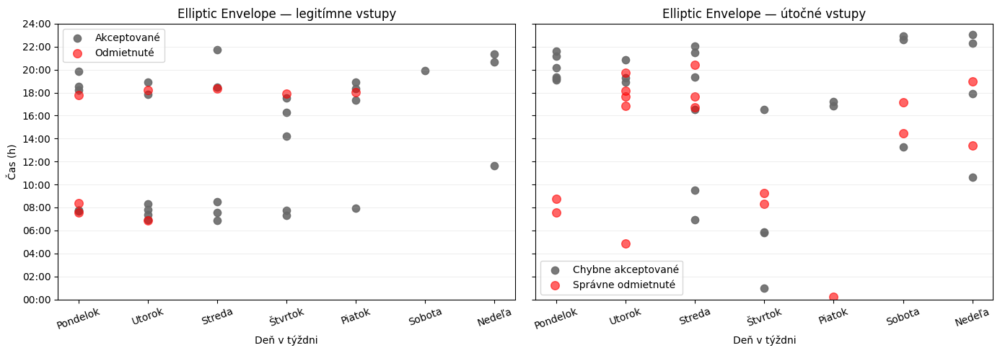
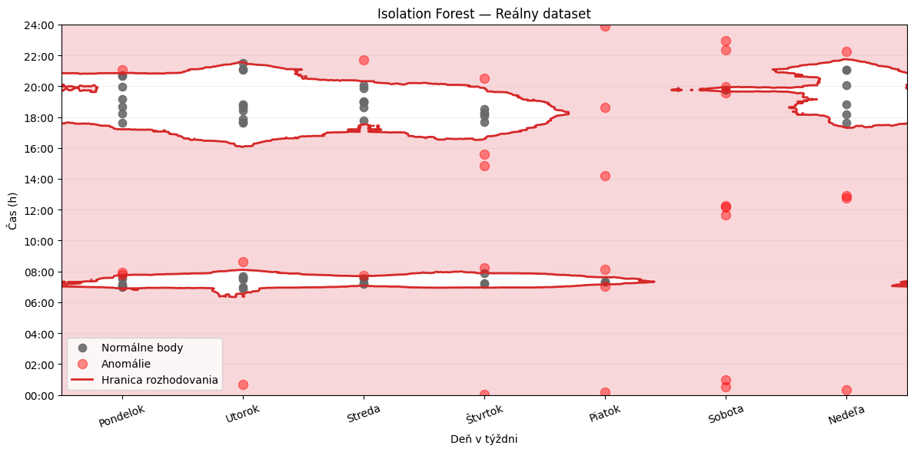
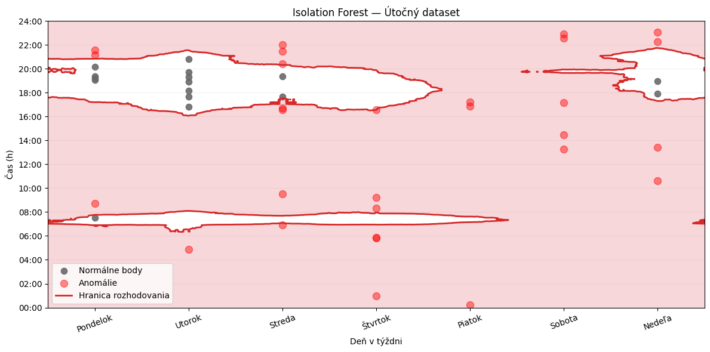
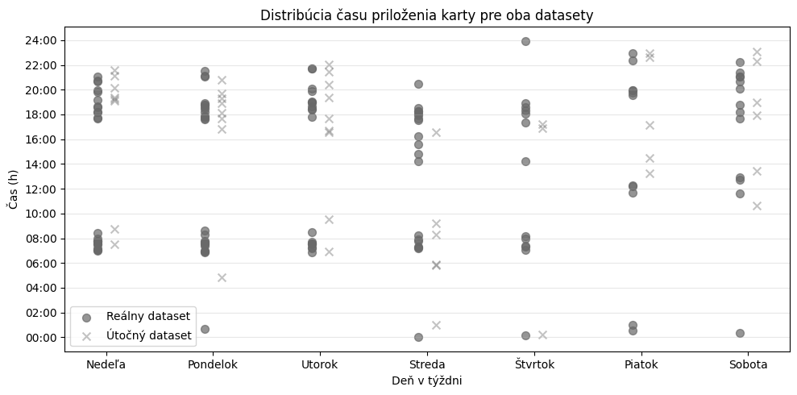

  

# Access Control System — RFID Anomaly Detection

Machine learning PoC that profiles a legitimate cardholder's entry behaviour from **RFID + Time-of-Flight sensor data** and flags deviations as potential unauthorized access. Built as a school research project (ŠkV — Školská vedecká činnosť).

---

## The idea

An RFID reader and a ToF distance sensor record every card tap. The system learns what a normal entry looks like — time of day, approach speed, card hold duration — and uses anomaly detection to flag anyone who doesn't match that profile, without needing any labelled attacker data.

---

## Features used per tap

| Feature | What it captures |
|---|---|
| `time_of_day_seconds` | Time of tap, encoded cyclically (so 23:59 → 00:00 is continuous) |
| `day_of_week` | Day of week, encoded cyclically |
| `rfid_hold_duration_ms` | How long the card was held against the reader |
| `tof_distance_mm_array` | Full distance profile of the hand/card approach |

The ToF array is reduced to derived features: approach speed, min/max/mean/std distance, approach distance.

---

## Two-phase study

**Phase 1 — Synthetic dataset** — generated from real dormitory access statistics to validate the approach before measurements were available.

**Phase 2 — Real captures** — 20 taps each from two real individuals, used to test generalization to genuine behavioural biometrics.

Each dataset is split 70 / 30 into training (owner only) and test sets. A separate attack dataset is used for FAR evaluation.

---

## Results

| Method | FRR | FAR | Notes |
|---|---|---|---|
| Threshold ±1 h (baseline) | 28.95 % | 26.67 % | Median tap time + fixed window |
| Isolation Forest | 13.16 % | 26.67 % | Time features only |
| One-Class SVM | 23.68 % | 2.22 % | |
| Local Outlier Factor | 10.53 % | 13.33 % | |
| Elliptic Envelope | 7.89 % | 0.00 % | |
| **Neural Network (autoencoder)** | **2.63 %** | **4.44 %** | Time + ToF features, fused branches |

The autoencoder was trained to reconstruct normal entry sequences. Inputs with reconstruction error above the 95th-percentile training threshold are flagged as anomalies.

---

## How the model learns

All models train exclusively on legitimate owner data. The red-shaded region is learned as anomalous; points outside the owner's normal time windows are flagged regardless of day.

On the attack dataset the same boundary catches a large fraction of intruder taps as anomalies.

The owner taps consistently around **08:00** and **18:00** each day — a clear behavioural pattern the models can exploit.

---

## Notebooks

| File | Language | Description |
|---|---|---|
| `01_synthetic_data.ipynb` | Slovak | Phase 1 — synthetic data |
| `01_synthetic_data_en.ipynb` | English | Phase 1 — synthetic data |
| `02_real_data.ipynb` | Slovak | Phase 2 — real captures |
| `02_real_data_en.ipynb` | English | Phase 2 — real captures |

Full written report: [`docs/`](docs/)

---

## Stack

Python · scikit-learn · pandas · NumPy · Matplotlib · Jupyter
